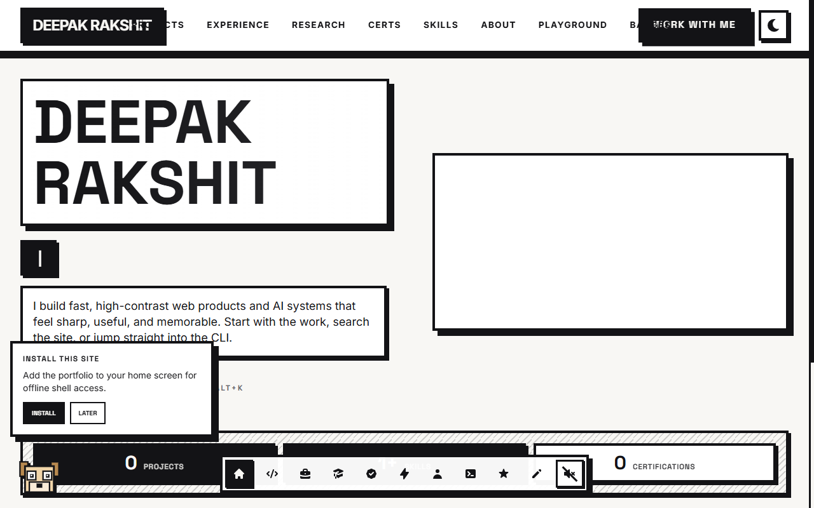
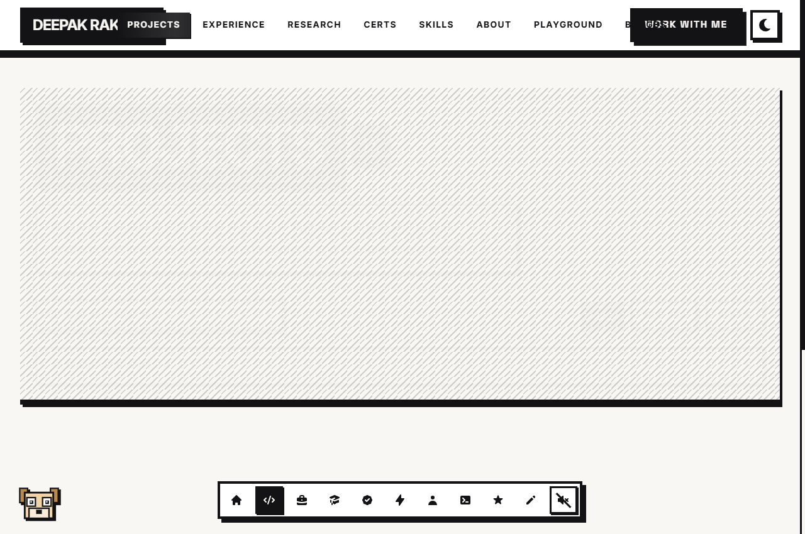
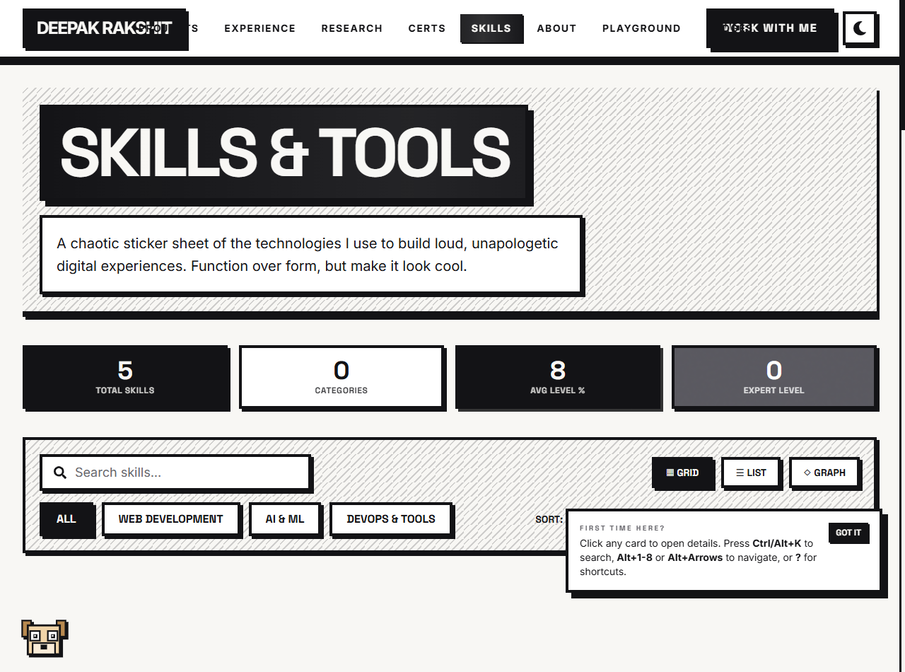
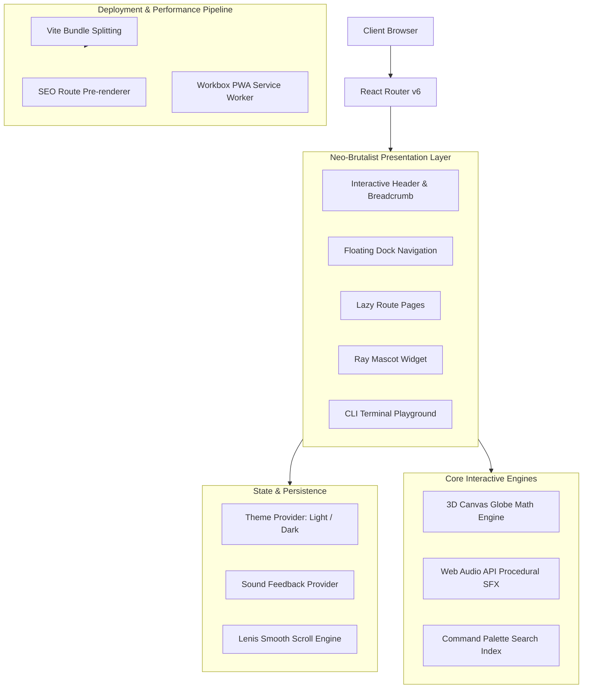

<div align="center">

<!-- Animated Header Banner -->


<!-- Dynamic Animated Typing SVG -->
<p align="center">
  <a href="https://deepakrakshit.is-a.dev/">
    
  </a>
</p>

<!-- Badges Matrix -->
<p align="center">
  <a href="https://deepakrakshit.is-a.dev/"></a>
  <a href="https://react.dev/"></a>
  <a href="https://vitejs.dev/"></a>
  <a href="https://tailwindcss.com/"></a>
  <a href="https://www.framer.com/motion/"></a>
  <a href="LICENSE"></a>
</p>

---

</div>

## 🌟 Visual Showcase

<div align="center">
  <table>
    <tr>
      <td width="50%">
        <h3 align="center">Interactive Homepage & Canvas Globe</h3>
        <a href="https://deepakrakshit.is-a.dev/">
          
        </a>
      </td>
      <td width="50%">
        <h3 align="center">Engineering Projects Catalog</h3>
        <a href="https://deepakrakshit.is-a.dev/projects">
          
        </a>
      </td>
    </tr>
    <tr>
      <td colspan="2" align="center">
        <h3 align="center">Interactive Skills & Technology Matrix</h3>
        <a href="https://deepakrakshit.is-a.dev/skills">
          
        </a>
      </td>
    </tr>
  </table>
</div>

---

## ⚡ Architectural & Engineering Highlights

```
┌────────────────────────────────────────────────────────────────────────┐
│  CORE CAPABILITIES                                                    │
├────────────────────────────────┬───────────────────────────────────────┤
│ 🌐 Zero-WebGL 3D Canvas Engine  │  60 FPS trigonometric sphere render   │
│ 🤖 Ray Desktop Mascot System   │  Autonomous speech bubble companion   │
│ ⌨️ Keyboard-First Power Nav     │  Ctrl+K command palette & Alt shortcuts│
│ 🔊 Procedural Web Audio Engine │  Synthesized real-time UI SFX         │
│ 📱 Offline PWA & Workbox       │  Service worker caching & installable │
│ 🚀 Pre-rendered SEO Routes     │  12 static routes + OpenGraph cards   │
└────────────────────────────────┴───────────────────────────────────────┘
```

### 1. 🌐 Zero-WebGL 3D Canvas Globe Engine
- Custom-engineered Canvas renderer that projects a 3D rotating spherical coordinates matrix onto a 2D canvas without importing Three.js or heavy WebGL libraries.
- Features visibility-aware rendering (`IntersectionObserver` + `Page Visibility API`), auto-pausing when out of viewport to preserve battery and maintain a steady **60 FPS**.

### 2. 🤖 Interactive Mascot Ray & Terminal Emulator
- **Ray Companion Widget**: Autonomous floating AI mascot equipped with route-aware speech bubbles, tip system, dynamic animations, and interactive touch responses.
- **Interactive CLI Playground**: Full neo-brutalist terminal interface with command execution (`sudo hire-me`, `skills --all`, `cat experience`, `theme toggle`, `sound --off`).

### 3. ⌨️ First-Class Keyboard Navigation
- **Command Palette**: Press <kbd>Ctrl</kbd> + <kbd>K</kbd>, <kbd>Cmd</kbd> + <kbd>K</kbd>, or <kbd>Alt</kbd> + <kbd>K</kbd> to launch instant fuzzy search across all routes, projects, and actions.
- **Route Jumps**: Rapid navigation via <kbd>Alt</kbd> + <kbd>1</kbd> through <kbd>Alt</kbd> + <kbd>7</kbd>.
- **Modal Trap & Focus Management**: Accessible focus traps on all modals (`ResumeModal`, `DevTools`) with automatic <kbd>Esc</kbd> dismiss.

### 4. 🔊 Procedural Web Audio Synthesizer
- Built-in sound synthesis engine using native browser `AudioContext`.
- Dynamically creates clicks, ticks, whooshes, and tone sweeps procedurally—eliminating audio asset downloads while delivering instant tactile feedback.

### 5. 🚀 SEO Pre-rendering & Progressive Web App
- Pre-renders 12 static HTML routes during build for instant indexing by web crawlers and zero layout shift.
- Workbox service worker caching strategy enables instantaneous offline loads and desktop/mobile PWA installation.

---

## ⌨️ Command Palette & Keyboard Shortcuts

| Shortcut | Action | Scope |
| :--- | :--- | :--- |
| <kbd>Ctrl</kbd> / <kbd>Cmd</kbd> + <kbd>K</kbd> | Open Global Command Palette | Global |
| <kbd>Alt</kbd> + <kbd>1</kbd> | Navigate to **Home** (`/`) | Global |
| <kbd>Alt</kbd> + <kbd>2</kbd> | Navigate to **About** (`/about`) | Global |
| <kbd>Alt</kbd> + <kbd>3</kbd> | Navigate to **Experience** (`/experience`) | Global |
| <kbd>Alt</kbd> + <kbd>4</kbd> | Navigate to **Skills** (`/skills`) | Global |
| <kbd>Alt</kbd> + <kbd>5</kbd> | Navigate to **Projects** (`/projects`) | Global |
| <kbd>Alt</kbd> + <kbd>6</kbd> | Navigate to **Certifications** (`/certifications`) | Global |
| <kbd>Alt</kbd> + <kbd>7</kbd> | Navigate to **Contact** (`/contact`) | Global |
| <kbd>?</kbd> | Open Interactive Keyboard Shortcut Guide | Global |
| <kbd>Tab</kbd> | Autocomplete Command in Playground CLI | Terminal |
| <kbd>Esc</kbd> | Dismiss Active Modal / Command Palette | Overlays |

---

## 🏗️ Architecture & Data Flow



---

## 📁 Repository Directory Structure

```text
Portfolio/
├── docs/
│   └── assets/                     # Visual showcase images & screenshots
├── frontend/
│   ├── public/
│   │   ├── favicons/               # App icons & device manifests
│   │   ├── manifest.json           # PWA web application manifest
│   │   ├── resume.pdf              # Candidate curriculum vitae PDF
│   │   ├── robots.txt              # Search engine crawler directives
│   │   └── sitemap.xml             # XML sitemap with all routes
│   ├── src/
│   │   ├── components/             # Reusable UI primitives
│   │   │   ├── Canvas/             # 3D trigonometric tech globe
│   │   │   ├── CommandPalette/     # Fuzzy search shortcut palette
│   │   │   ├── Dock/               # Floating desktop/mobile dock
│   │   │   ├── Header/             # Global sticky navigation bar
│   │   │   ├── RayMascot/          # Autonomous interactive AI mascot
│   │   │   └── ResumeModal/        # Sandboxed PDF document viewer
│   │   ├── context/                # Theme, Sound, Toast & Scroll providers
│   │   ├── data/                   # Projects, skills, experience data schemas
│   │   ├── hooks/                  # Keyboard, modal lock, scroll visibility
│   │   ├── pages/                  # Code-split route components
│   │   └── utils/                  # Procedural audio, search index, motion
│   ├── scripts/                    # SEO prerender and sitemap generators
│   └── vercel.json                 # Security headers, rewrites & caching
├── DeepakRakshit_Resume.pdf        # Verified curriculum vitae asset
├── LICENSE                         # MIT open source license
└── README.md                       # Comprehensive documentation
```

---

## 📊 GitHub Analytics & Activity

<div align="center">

<a href="https://github.com/deepakrakshit">
  
  
</a>

<br/>

<a href="https://github.com/deepakrakshit">
  
</a>

</div>

---

## 🛠️ Local Development & Quick Start

### Prerequisites
- **Node.js**: v18.0.0 or higher
- **npm**: v9.0.0 or higher

### Installation & Run

```bash
# 1. Clone repository
git clone https://github.com/deepakrakshit/Portfolio.git

# 2. Enter workspace
cd Portfolio/frontend

# 3. Install dependencies
npm install

# 4. Start local development server
npm run dev
```

The application will be live at `http://localhost:3000`.

### Available Scripts

| Command | Action |
| :--- | :--- |
| `npm run dev` | Launch Vite hot-reloading development server on port 3000 |
| `npm run build` | Generate pre-rendered static routes & optimized production bundle |
| `npm run preview` | Locally preview the compiled production distribution |
| `npm run lint` | Execute ESLint static code analysis across codebase |

---

## 🚀 Deployment Guide

### Deploying to Vercel

1. Import this repository into [Vercel](https://vercel.com).
2. Configure **Project Settings**:
   - **Framework Preset**: `Vite`
   - **Root Directory**: `frontend`
   - **Build Command**: `npm run build` (auto-detected)
   - **Output Directory**: `dist` (auto-detected)
3. Deploy! Static routes, resume document serving (`/resume.pdf`), and PWA service worker caching will activate automatically.

---

## 🤝 Connect & Socials

<div align="center">

<p align="center">
  <a href="https://www.linkedin.com/in/deepakrakshit/">
    
  </a>
  <a href="https://github.com/deepakrakshit">
    
  </a>
  <a href="https://www.instagram.com/de3pakkk/">
    
  </a>
  <a href="mailto:deepakrakshit505@gmail.com">
    
  </a>
  <a href="https://deepakrakshit.is-a.dev/">
    
  </a>
</p>

<!-- Animated Footer Wave -->


</div>

---

<p align="center">
  <sub>Crafted with precision by <b>Deepak Rakshit</b>. Licensed under <a href="LICENSE">MIT</a>.</sub>
</p>
